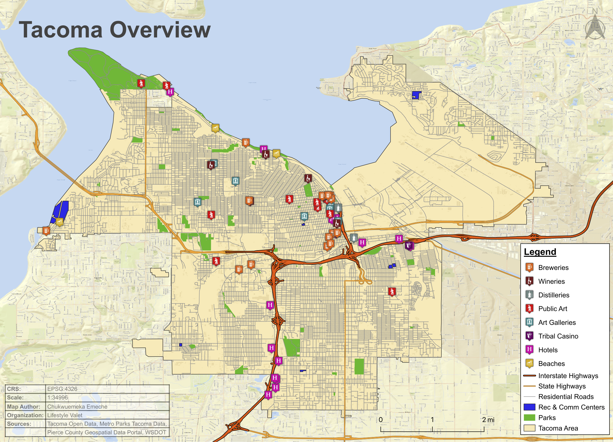
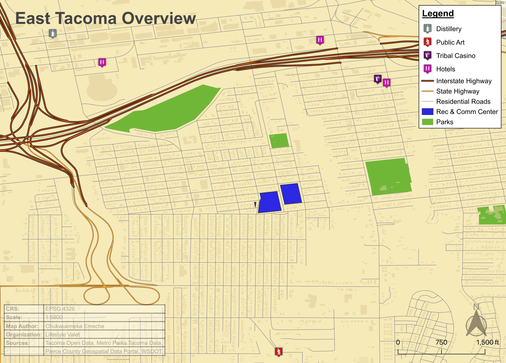

# City of Destiny — Tacoma Tourism Attractions Mapping

A client-commissioned geospatial mapping project built for a client, focused on cataloguing and visualizing tourism attractions across Tacoma, Washington. The goal was to produce a detailed, layered map of the city's cultural and recreational offerings — breweries, wineries, distilleries, public art, art galleries, hotels, beaches, parks, tribal casinos, and recreation & community centers — giving the client a geographic reference tool for tourism planning and promotion.

## How It's Made

**Tech used:**   

 

  

The project was built entirely in **QGIS** using **EPSG:4326 (WGS 84)** as the coordinate reference system, keeping everything consistent and export-ready across all map outputs. Data was sourced from a combination of public portals — Tacoma Open Data, Metro Parks Tacoma, the Pierce County Geospatial Data Portal, and WSDOT — and layered together to build out the base map before any attraction points were added.

The bigger challenge was the attraction-specific data. There were no existing datasets for breweries, wineries, public art pieces, distilleries, or art galleries, so those had to be built from scratch. Each point and polygon was manually digitized using the **HPI Polygon Tool** (http://apps.headwallphotonics.com/), then brought into **geojson.io** to apply attributes — names, categories, and any additional metadata — before being exported into a QGIS-compatible format and scaled properly within the project.

To make sure the coordinates were accurate, every point was cross-referenced using **Google Earth** and verified against official documentation from each tourism site. Nothing was placed by assumption — if a location couldn't be confirmed through the venue's own materials or satellite imagery, it didn't go on the map.

The final deliverable was structured as a city-wide overview map alongside a series of neighborhood-level breakdowns. Tacoma was divided into sub-area frames — including a five-part East Tacoma series — so that each section of the city could be viewed at a meaningful scale without losing detail. Each map layout was exported as a print-ready PDF at its respective scale.

## Maps

**Tacoma Tourism Attractions Overview** *(Scale: 1:34,996)*

The city-wide overview shows the full spread of tourism attractions across Tacoma, color-coded and symbolized by category. The concentration of breweries, public art, and art galleries in the downtown and Stadium District areas is visible right away, which tracks with how those neighborhoods are positioned as Tacoma's cultural core. Hotels are distributed more broadly, particularly along the highway corridors, and parks form a consistent green backbone across the city.

**East Tacoma Overview** *(Scale: 1:5,800)*

The East Tacoma breakdown zooms in to show how the neighborhood's attractions sit relative to the road network and green space. At this scale, the relationship between the rec & community centers, parks, and the highway infrastructure becomes a lot clearer — useful context for anyone trying to understand how accessible these spots actually are from different parts of the city.

## Optimizations

One of the more time-intensive parts of the project was building the point and polygon datasets from nothing. When you're manually placing every brewery, gallery, and public art piece, accuracy has to be the priority — so the workflow of digitizing in the HPI Polygon Tool, attributing in geojson.io, and then verifying coordinates against Google Earth satellite imagery and official venue documentation added steps, but it was the right way to do it. Cutting corners on location accuracy in a tourism map defeats the purpose.

A recurring challenge during digitizing was polygon persistence in the custom polygon workflow — even after removing building backgrounds on specific polygons and saving the changes, the elements themselves wouldn't clear, requiring additional cleanup passes. It's worth catching earlier in the process next time.

The multi-scale layout approach — one overview, one neighborhood overview, and a numbered detail series — was a deliberate choice to make the maps actually usable at different levels of engagement. A city-wide map is great for context; a 1:1,135 detail frame is what you need when you're standing on a corner trying to find something. Producing both meant the client had a complete reference set rather than one map trying to do too much.

## Lessons Learned

This project made it clear how much of real-world geospatial work involves building your own data rather than consuming existing datasets. Public data portals are a solid foundation, but the moment you get into niche categories — craft beverage venues, street murals, smaller galleries — you're largely on your own. Getting comfortable with the full manual digitization pipeline, from HPI Polygon Tool to geojson.io to QGIS, is a genuinely practical skill that doesn't always get covered in the tools-first approach.

The verification step also stood out as something easy to skip but important to get right. Cross-referencing every point through Google Earth and official source documentation takes time, but it's what separates a map that's useful from one that's just visually polished. For a client-facing deliverable, that distinction matters.

Working in QGIS across multiple layout scales also reinforced how much thought goes into cartographic design decisions — scale, symbolization, legend placement, label density — and how those choices compound when you're producing a series of maps that need to read consistently as a set.

## Data Sources:

Tacoma Open Data · Metro Parks Tacoma · Pierce County Geospatial Data Portal · WSDOT  
*CRS: EPSG:4326 (WGS 84) · Map Author: Chukwuemeka Emeche*

## Examples:

Take a look at these couple examples that I have in my own portfolio:

**GIS Data Types, Storage, and Conversion:** [GIS Conversion](https://github.com/NomadCode33/NomadGeo/tree/main/MeridianDrift-Atlas/gis-data-types-storage-conversion)

**ElevationDelta:** [Raster Analysis](https://github.com/NomadCode33/NomadGeo/tree/main/ElevationDelta)

**EcoPulse Report:** [EcoPulse Climate Analysis Report](https://github.com/NomadCode33/NomadGeo/tree/main/EcoPulse/EcoPulse%20Climate%20Analysis%20Report)

## Repositories

**Profile:** [NomadCode33](https://github.com/NomadCode33)

**Main Repository:** [NomadGeo](https://github.com/NomadCode33/NomadGeo)

