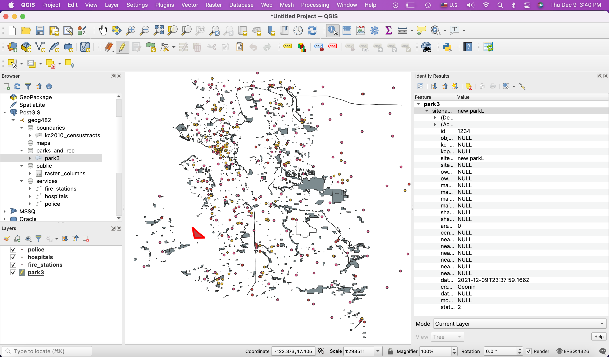

# CloudCanvas: Cloud-Based Spatial Database Management with Microsoft Azure

An exercise in deploying and managing a cloud-hosted spatial database using Microsoft Azure and PostgreSQL. This project covers the full pipeline — from provisioning a cloud server on Azure to building a structured PostGIS-enabled database, managing multi-user access through role-based permissions, and automating spatial data population using SQL trigger functions. The work was done across four stages, each building directly on the last.

## How It's Made:

**Tech used:** 

The project started with provisioning a cloud database server on Microsoft Azure. Using the Azure Portal, I set up an Azure Database for PostgreSQL single-server instance (`enterprisegisee`) under a resource group called `my_gis_group`, configured with 1 vCore and 5 GB of Basic storage to stay within the available credit. After deployment, I configured the firewall rules to allow public access, added the current client IP address, and enforced SSL connections. To connect to the server, I opened Azure Cloud Shell, selected Bash, and used `psql` to connect via the command line. From there I created a new database called `myspatialdb` and ran `CREATE EXTENSION postgis;` to enable spatial support.

With the server running, I connected it to QGIS through a PostGIS connection using port 5432 and SSL mode set to `require`. Inside QGIS's DB Manager, I used the SQL window to build out the database schema structure — creating four schemas (`boundaries`, `maps`, `parks_and_rec`, and `services`) to organize five King County shapefiles: 2010 census tracts, parks, fire stations, hospitals, and police stations. Each shapefile was imported into its corresponding schema using the Import Layer/File tool, with the parks layer importing 1,200 of 1,417 features due to a known data limitation.

From there, I set up role-based access control entirely through SQL. I created two roles — `read_only` and `editor` — with specific PostgreSQL parameters controlling login access, superuser status, and replication. Both roles were granted connection access to `myspatialdb`. I then created two users: `bob` with `read_only` access only, and `sarah` with both `read_only` and `editor` roles. Schema-level and table-level permissions were granted accordingly, with the parks table being the only layer made editable. For the independent deliverable, I created two additional users using my own first and last name (`emeka` assigned `read_only`, `emeche` assigned `editor`), verified the full user list in Azure Cloud Shell using `\du`, and confirmed the role assignments matched expectations.

The final stage involved writing a PostgreSQL trigger function to automate spatial calculations whenever a row is inserted or updated in the parks table. I first used `ALTER TABLE` to add new columns — park area in square meters, census tract, nearest police station, nearest hospital, nearest fire station, distances to each in meters, and metadata fields for creation timestamp, creator, modification timestamp, and modifier. The trigger function (`park_trigger_function`) used PostGIS functions including `ST_Area`, `ST_Transform`, `ST_Intersects`, `ST_Centroid`, and `ST_Distance` to calculate and populate each field automatically on INSERT or UPDATE. I then created the trigger itself using `CREATE TRIGGER`, binding it to the parks table to fire before each row-level insert or update. To test it, I added a new park polygon directly in QGIS using the Toggle Editing and Add Polygon Feature tools, saved the edit, and confirmed through the Identify Feature tool that all spatial fields — nearest services, distances, census tract, metadata — had been automatically populated by the trigger.

## Optimizations

One of the first issues I ran into was a connection error when trying to `psql` into the server without specifying `--dbname=postgres` — the server rejected the connection because it defaulted to looking for a database matching the username, which didn't exist. Adding the `--dbname` flag resolved it. When importing the parks shapefile, the import returned error 6 with only 1,200 of 1,417 features written — rather than blocking progress, I proceeded with the partial import since it was sufficient for the access control and trigger work downstream. For the trigger function, the `parks_and_rec.park_id_seq` relation didn't exist initially, which caused the `GRANT ALL ON SEQUENCE` command to fail. I resolved this by running `ALTER TABLE` to drop the existing `id` column, re-add it as a `serial` type to generate the sequence, and then setting it as the primary key — a required step for enabling row-level edits in QGIS. Managing Azure Cloud Shell sessions carefully also mattered throughout; closing the terminal mid-session meant reconnecting and re-authenticating with psql each time.

## Lessons Learned:

This project made the real-world mechanics of cloud database management click in a way that reading about it doesn't. Provisioning the Azure PostgreSQL server, configuring firewall rules, and connecting through both psql and QGIS are the kinds of tasks that show up in enterprise GIS environments, and going through each step manually made the underlying infrastructure feel less abstract. The role-based access control section was probably the most instructive part — writing SQL to create roles, grant connection permissions, assign schema-level usage, and control table-level read versus edit access is a pattern that scales directly to production environments where multiple teams need different levels of access to the same dataset. The trigger function brought together several PostGIS spatial functions in a single automated workflow, which reinforced how much can be offloaded to the database layer rather than handled in application code. If the geometry changes, the metadata updates — no manual intervention needed.
