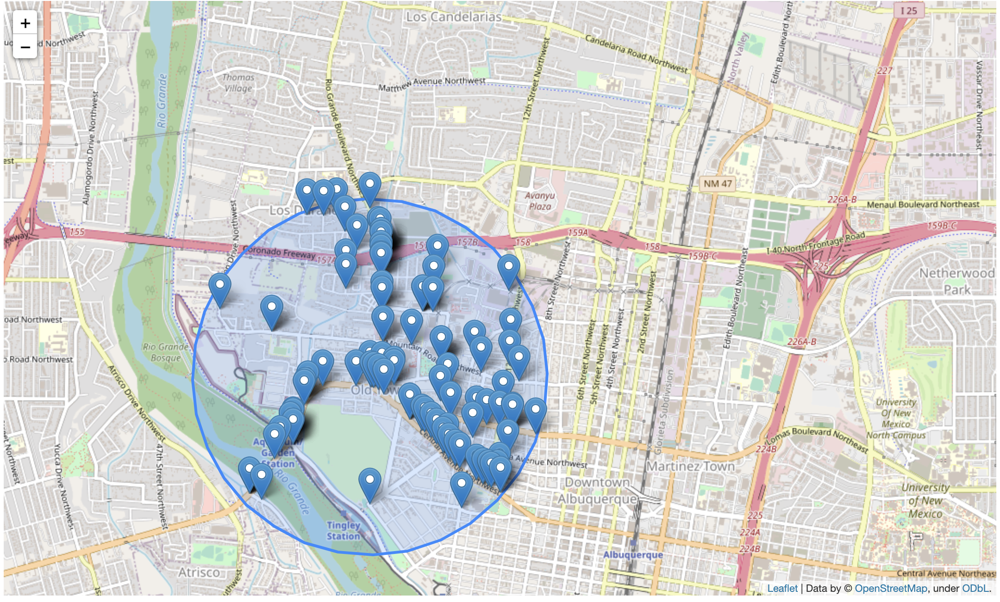

# GeoQuery ABQ — Crime Analysis with Geospatial Databases

An exploration of geospatial database management focused on building, querying, and visualizing crime data using PostgreSQL with PostGIS. Working with live public safety data from the City of Albuquerque, this project covers how to set up a spatial database from scratch, load geospatial data from a live web service, perform geoprocessing operations, and surface the results through interactive maps and charts — all from within a Python/JupyterLab environment.

## How It's Made:

**Tech used:**   
 

 

 

The project started with setting up a local PostgreSQL instance and enabling the PostGIS extension to make it spatially aware. From there, three geospatial database tables were created to organize the data: one for area commands (broad patrol zones), one for police beats (subdivisions within those zones), and one for individual crime incidents. Each table included a `GEOMETRY` field, making it a proper geospatial database schema.

With the tables in place, data was pulled directly from the City of Albuquerque's ArcGIS REST services using the `requests` library. The area command and beat boundaries came in as polygon rings in JSON format, which were assembled into `MultiPolygon` objects with Shapely before being inserted into the geospatial database using `ST_GeomFromText()`. Incident data came in as point geometries — with date parsing, null-coordinate handling, and try/except blocks in place to manage the messiness of real-world public data.

Once the geospatial database was populated, the work shifted to spatial querying and visualization. Folium was used to render interactive maps in Jupyter by converting query results to GeoJSON via PostGIS's `ST_AsGeoJSON()`. Three core spatial workflows were built out:

**Buffer analysis (Q1):** A 500-meter buffer was constructed around the coordinates of Old Town Albuquerque using `ST_Buffer()` with a geography cast for accurate metric distance. Incidents within that buffer over the past 150 days were retrieved using `ST_Intersects()`, returning 81 incidents. The buffer and incident points were mapped together with Folium and rendered over an OpenStreetMap basemap.

**Area command widget (Q2):** The `areacommand` table's area names were first queried from the geospatial database to confirm valid input values. From there, `ipywidgets` was used to build an interactive text box that triggers a spatial JOIN between the incidents and areacommand tables using `ST_Intersects()` — filtering results to a user-specified area and a 150-day date window. Typing `VALLEY` into the widget produced a map showing all incidents in that area command for the given period.

**Crime counts by area:** A SQL query joining the areacommand and incidents tables using `ST_Contains()` was loaded into a pandas DataFrame to count incidents per area. The intent was to produce a summary table showing which area had the highest crime count — the code was written and the query executed successfully, but a `NameError` caused by `pd` not being defined in the execution context prevented the DataFrame from rendering. The query logic itself was sound; the error was an environment/import issue that came up late in the notebook. The VALLEY area was selected for the interactive map portion, and based on the density visible in the map output, it appeared to be among the higher-activity zones in the dataset.

## Optimizations

One recurring challenge with this project was the ephemeral nature of the database environment. Because the PostgreSQL instance was running locally on a JupyterHub server, it had to be deleted and fully rebuilt every session — including re-running the terminal setup commands, re-establishing the connection, and re-populating all three geospatial tables from the live web service. This made it important to keep the setup code clean and reproducible from top to bottom.

On the geospatial query side, using PostGIS functions directly in SQL — rather than pulling everything into Python and processing it there — kept the spatial operations fast and clean. Functions like `ST_Intersects()`, `ST_Contains()`, `ST_Buffer()`, and `ST_AsGeoJSON()` did the heavy lifting inside the geospatial database itself, with Python handling the display layer. That separation made the code easier to read and debug.

The `ipywidgets` integration also stood out as a cleaner approach than hardcoding area names. Rather than rewriting the SQL query every time, the widget lets you swap in any area command name and get an updated map without touching the underlying code — which is closer to how a real crime dashboard would work.

## Lessons Learned

This project made it clear just how much of the work in geospatial database analysis happens before you ever get to a map. Setting up the database, defining the schema with proper geometry fields, pulling from a live REST API, handling null values and malformed coordinates, and managing the session lifecycle — all of that was necessary just to get to the point where a spatial query was possible.

Working with PostGIS specifically reinforced how useful it is to keep spatial logic inside the geospatial database. Operations like buffering a point, finding intersections, or doing point-in-polygon lookups are things you *can* do in Python with Shapely, but doing them in SQL through PostGIS means the geospatial database handles the geometry efficiently and you're not pulling more data into memory than you need.

The interactive widget piece was a useful introduction to how spatial queries can be surfaced for non-technical users. Being able to type in an area name and get a live map — without writing new code each time — is a small step toward the kind of interface a real crime dashboard would need.

And the `NameError` at the end was a good reminder that environment state matters. A query can be logically correct and still not run if the context it depends on isn't set up right. That's not a GIS problem — it's a workflow problem, and it's worth paying attention to.
