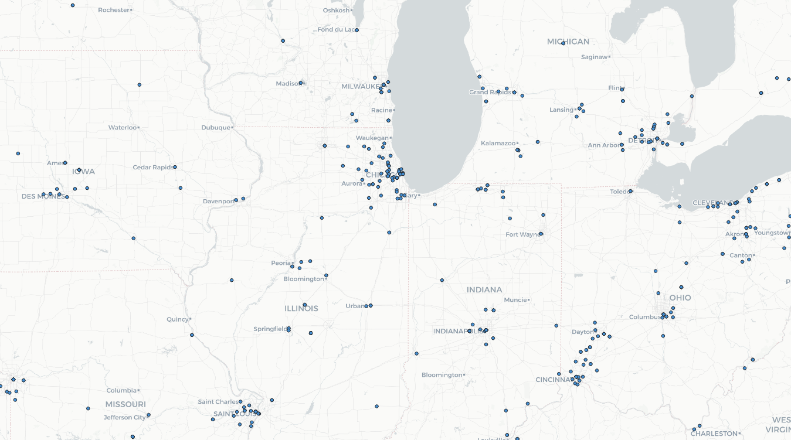
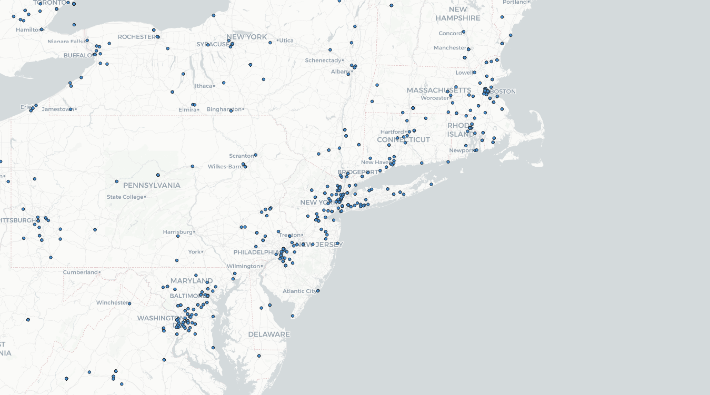

# GeoSignal — Geo-Tagged Tweet Collection & Regional Language Analysis

An exploration of social media data through a geographic lens, focused on streaming, collecting, and visualizing real-time geo-tagged tweets across the United States using Python. This project examines how location shapes the language people use online — comparing the Twitter activity and word patterns of two distinct regions: the Chicago/Illinois area and the New York area.

## How It's Made

**Tech used:** Python, Tweepy, Pandas, Google Colab, Twitter Streaming API, WordArt

The project was built entirely in **Google Colab**, which handled the cloud execution environment without any local setup overhead. The script connects to the **Twitter Streaming API** via **Tweepy**, authenticating through OAuth and filtering the live tweet stream by geographic bounding boxes that cover the contiguous United States, Alaska, and Hawaii.

```python
LOCATIONS = [-124.7771694, 24.520833, -66.947028, 49.384472,  # Contiguous US
              -164.639405, 58.806859, -144.152365, 71.76871,   # Alaska
             -160.161542, 18.776344, -154.641396, 22.878623]   # Hawaii
```

A custom `StreamListener` class was written on top of `tweepy.StreamListener` to handle the real-time data flow. It ran for a set time window (10 minutes), capturing incoming geo-tagged tweets and appending them to a results list before writing everything out to a **CSV** file saved directly to Google Drive. From there, the CSV was downloaded locally for analysis.

The collected data was then filtered and visualized by region. I chose to compare **Illinois** and **New York** — two areas that are both heavily populated but carry very different geographic and social characters. The tweet coordinates were plotted on interactive maps to visualize spatial distribution, and the tweet text was exported into **WordArt** to generate word clouds shaped to reflect each region.

## Maps


*Geo-tagged tweet distribution across the Illinois/Chicago region*


*Geo-tagged tweet distribution across the New York region*

I chose to compare Illinois and New York because both are expansive, high-profile regions — yet they show noticeably different Twitter activity patterns. Visually, the maps tell the story pretty clearly. New York's dot density is significantly higher, especially concentrated around New York City, where the sheer volume of people, jobs, and constant movement keeps social media activity high.

Illinois follows a more dispersed pattern. The Chicago metro pulls in a strong cluster of posts, but once you move outside the city, activity spreads thin across more rural, nature-heavy areas. Those quieter zones still show up on the map, but the contrast with the urban core is stark. It points to how urban density doesn't just affect foot traffic — it shapes how and how often people post online too.

## Word Art


*Most frequent words from Illinois-area tweets — floppy disk shape*


*Most frequent words from New York-area tweets — brain shape*

Both regions ended up sharing a lot of the same high-frequency words, which makes sense given that the stream was pulling from the same general time window. The top terms across both clouds — "Go," "Out," "Day," "Up," "Love," "Good," "Time" — are the kind of casual, directional language people default to on social media.

"Go" standing out as the dominant word in the floppy disk cloud is interesting — it works as both a directional word and a social cue, which probably explains why it shows up so much. People use it to point someone somewhere, describe where they're headed, or just as filler. The brain-shaped cloud layers in a few more emotional and activity-based terms like "Love," "Play," and "Work," which hints at slightly different conversational tones between the two areas.

One limitation worth noting: the stream collected tweets broadly across each region rather than isolating city-specific content, so the word clouds reflect regional patterns more than hyperlocal ones. That's something worth refining in a future version — pulling tighter bounding boxes to isolate Chicago vs. NYC proper would likely surface more distinct differences.

## Optimizations

One thing that shaped this project early on was the time-bound nature of the Twitter stream. Since `StreamListener` runs for a fixed window, the volume of data collected is directly tied to when the script ran and how active the stream was at that moment. Running the collector during higher-traffic periods (evenings, weekends) would likely yield denser, more representative datasets.

The geographic filter was set at the national level to capture as much data as possible, with regional comparison happening at the analysis stage rather than the collection stage. A more targeted approach — running separate streams filtered to tighter bounding boxes around Chicago and NYC — would give cleaner regional splits and make the word cloud comparison more meaningful.

OAuth credential management was handled directly in the notebook for this exercise. In any production-facing version, moving those keys to environment variables or a secrets manager would be the right call.

## Lessons Learned

The biggest takeaway from this project is how much geographic context matters when interpreting social data. The raw tweet text from Illinois and New York looks nearly identical at the surface level — same common words, same casual register — but the map tells a completely different story. Where people are posting matters just as much as what they're posting.

Working with the **Twitter Streaming API** through **Tweepy** also made it clear that real-time data collection is inherently messy. You're capturing a snapshot, not a census. The data you get depends on timing, platform activity, and how tight your filters are. Learning to design around that uncertainty — building in time limits, handling stream interruptions, and thinking critically about what the collected sample actually represents — was probably the most practically useful part of this whole exercise.

Using **Google Colab** for cloud execution was a smooth experience overall. Not having to configure a local environment meant more time spent on the actual analysis, which is the right tradeoff for a data-focused project like this.
