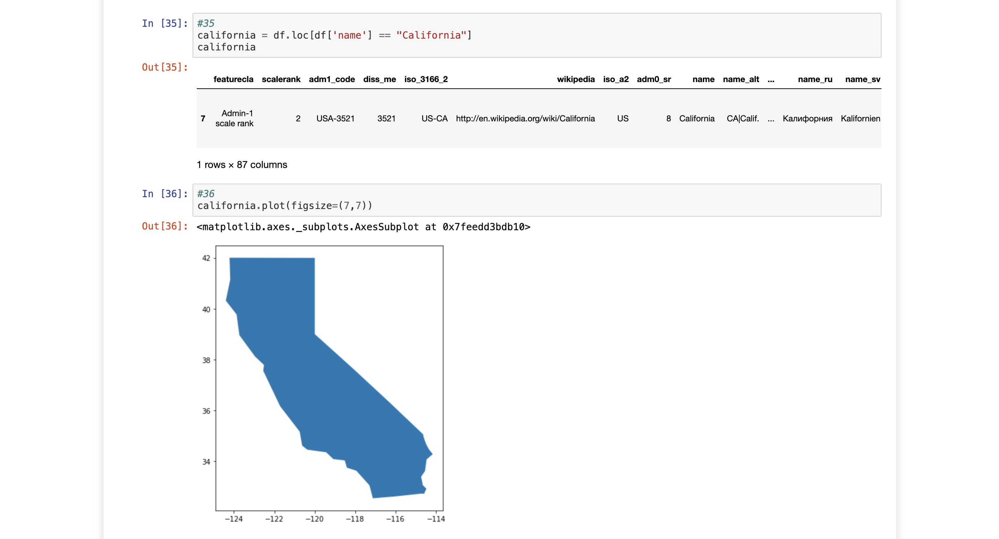

# Vector Data Scripting Analysis

An exercise in geospatial vector data processing and scripting using Python. This project covers three core geospatial libraries — OGR, Shapely/Fiona, and GeoPandas — and demonstrates how to use each one to create, manipulate, analyze, and visualize vector data. The independent section applies these scripting skills to real wildfire datasets, performing spatial joins and producing choropleth maps that compare wildfire counts across U.S. states for two separate time periods.

## How It's Made:

**Tech used:**   

 
 
 

The project was organized around three libraries, each covered in sequence to show how they approach the same class of problems differently.

Starting with OGR, we wrote scripts to construct polygon geometries from scratch — first by manually defining ring coordinates and assembling them into a polygon, then by passing in GeoJSON directly using `ogr.CreateGeometryFromJson()`. From there, we ran a series of geometric operations on the polygon: computing its area and centroid, extracting its boundary and convex hull, applying a buffer, and checking whether a point fell inside it using `polygon.Contains()`. We then scripted the full pipeline to write that polygon out to a new shapefile — setting the spatial reference with `osgeo.osr`, creating the data source and layer, wrapping the geometry in a feature, and saving it to disk. We also used OGR's `SetSpatialFilterRect()` to apply a bounding box filter over the Natural Earth populated places dataset, pulling only U.S. cities within the state of Texas and surrounding region.

The Shapely and Fiona section focused on geometry creation and file reading. We used Shapely to build points, lines, linear rings, polygons, and multi-geometry collections, and applied geometric methods like `.area`, `.bounds`, `.length`, and `.geom_type` to inspect them. We also fed JSON directly into Shapely using the `shape()` method and read it back out with `mapping()`. On the Fiona side, we opened a shapefile of U.S. state boundaries, accessed the first feature as a dictionary, and printed its keys, properties, and geometry using `pprint`. We then combined Fiona and Shapely to access and render the full vector geometry of Minnesota directly from the shapefile.

The GeoPandas section brought everything together for real analysis. We loaded the U.S. states shapefile into a GeoDataFrame and used pandas-style methods — `.loc`, `.iloc`, and `.cx` — to subset and plot individual states and regional bounding boxes. We then scripted a full wildfire analysis workflow: loading the MTBS fire point data, identifying the CRS mismatch between the fires (EPSG:4269) and states (EPSG:4326) files, reprojecting with `.to_crs()`, performing a spatial join using `geopandas.sjoin()`, grouping the results by state with `.groupby('name').size()`, merging the counts back into the states GeoDataFrame, and producing choropleth maps with `states.plot(column='number_of_fires')` across multiple color schemes. We also ran a data inspection check post-join to verify row counts and check for empty geometry fields.

For the independent section, I applied this full scripting workflow to two separate time-split wildfire datasets — 1985–1999 and 2000–2014. For each, I loaded the data, reprojected to WGS84, ran the spatial join against the states file, computed per-state wildfire counts, merged the counts back, and produced a titled choropleth map with axis labels removed for clean output.

## Optimizations

Working through OGR, Shapely/Fiona, and GeoPandas back to back made the tradeoffs between them concrete. OGR gives you fine-grained control when scripting geometry creation and shapefile output, but the syntax is verbose — setting spatial references, creating data sources, building features manually. Shapely cuts that overhead for geometry work since it renders directly in Jupyter and uses clean, readable method calls. GeoPandas is where the real analytical power is, especially for anything involving attribute joins, group aggregations, and choropleth mapping. Keeping the spatial join workflow modular — loading, reprojecting, joining, counting, merging, and plotting as discrete steps — made it straightforward to repeat the same pipeline cleanly for both the 1985–1999 and 2000–2014 datasets without running into naming collisions or CRS issues.

## Lessons Learned:

This project reinforced how much scripting discipline matters in geospatial work. The spatial join between the wildfire points and state boundaries only works correctly when both datasets are in the same CRS — something easy to overlook but guaranteed to break results silently if you don't catch it. Comparing row counts before and after the join (25,614 fires in the full dataset vs. 28,461 matched after the join in the guided section) was a good reminder that data inspection should be a built-in step, not an afterthought. On the analysis side, seeing how drastically wildfire distributions shifted between the two time periods — Florida dominated both, but Kansas and Texas surged significantly in 2000–2014 while West Virginia and Kentucky dropped off — showed how much the same scripting pipeline can reveal when you apply it to segmented data. Writing reusable code for each time period rather than duplicating logic was the right approach and made the comparison much cleaner to produce.

## Examples:

Take a look at these couple examples that I have in my own portfolio:

**ReefWatch:** [ReefWatch: Coral Reef Health Monitoring Dashboard](https://github.com/NomadCode33/NomadGeo/tree/main/GreenMap%20Initiative/ReefWatch)

**SailLines:** [SailLines: The 1779 Transatlantic Race](https://github.com/NomadCode33/NomadGeo/tree/main/CartoCraft/SailLines)

**Sumner Jurisdiction Boundary:** [Sumner Jurisdiction Boundary](https://github.com/NomadCode33/NomadGeo/tree/main/Furtado-Associates-Projects/Sumner%20Jurisdiction%20Boundary)

## Repositories

**Profile:** [NomadCode33](https://github.com/NomadCode33)

**Main Repository:** [NomadGeo](https://github.com/NomadCode33/NomadGeo)