# TileTrace PNW — Web Map Design & Tile Generation

An exploration of web map design and tile generation focused on building, styling, and serving four distinct map tile sets across the Pacific Northwest and the contiguous United States. Using **Mapbox Studio** and **QTiles**, this project covers how to design custom basemaps, generate thematic layers, combine tile sets, and deploy them as a fully interactive web map using **Mapbox GL JS** with a layer switcher for toggling each tile set on and off.

**Link to Project:** https://nomadcode33.github.io/TileTracePNW

## How It's Made
**Tech used:** 

 
 

The project is structured around four tile sets, each serving a different cartographic purpose. All tiles were generated using **QTiles** and served as raster tile layers in a **Mapbox GL JS** web application. The interface includes a layer switcher in the top-right corner that lets users toggle between all four layers independently — built using Mapbox's `setLayoutProperty` method to control layer visibility without reloading tiles.

The map is centered on the University of Washington area at zoom level 12 (`[-122.2559435, 47.6002614]`) as the default view, with the full interactive extent covering the Pacific Northwest and the broader contiguous United States depending on which tile set is active.

## Map Tile Sets

### 1. Custom Basemap (uw3)
**Geographic Area:** Contiguous United States, centered on the Pacific Northwest  
**Zoom Levels:** 0–5

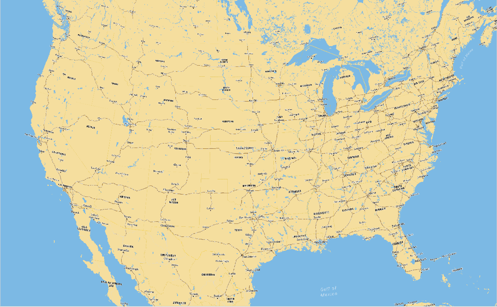
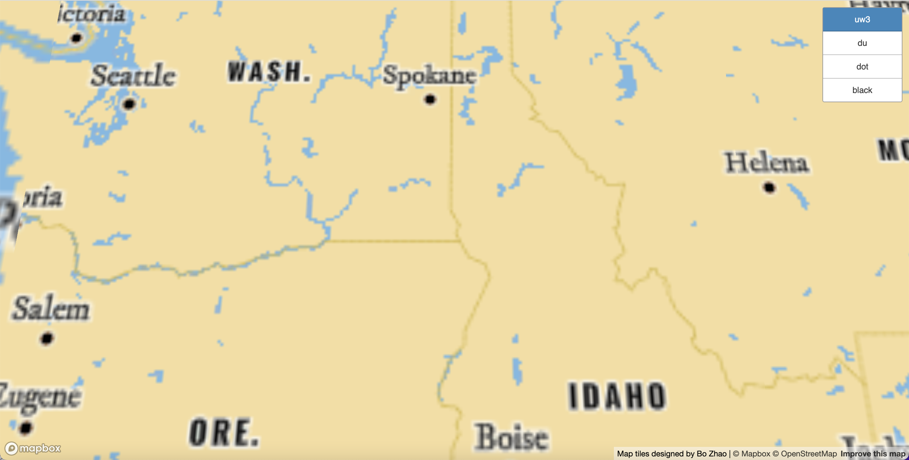
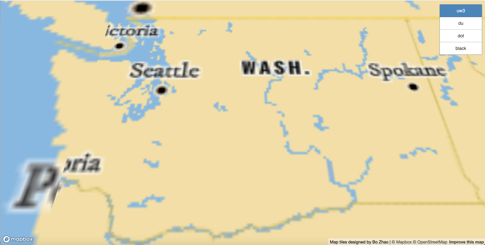

The custom basemap was designed in **Mapbox Studio** starting from an existing monochrome style and modified to stand on its own visually. Color choices, label fonts, and icon sets were all adjusted to produce a warm tan and blue palette — water rendered in light blue, land in a sandy yellow — with place labels using a heavier serif-adjacent typeface to distinguish it from Mapbox defaults. The basemap covers the full United States and is designed to serve as the geographic context layer that other thematic data can be overlaid on. The tile rendering does show some softness at higher zoom levels, which is a known tradeoff of the tile resolution set during QTiles export.

### 2. Dot Density Tilemap — Fast Food Chains (dot)
**Geographic Area:** Contiguous United States  
**Zoom Levels:** 0–5

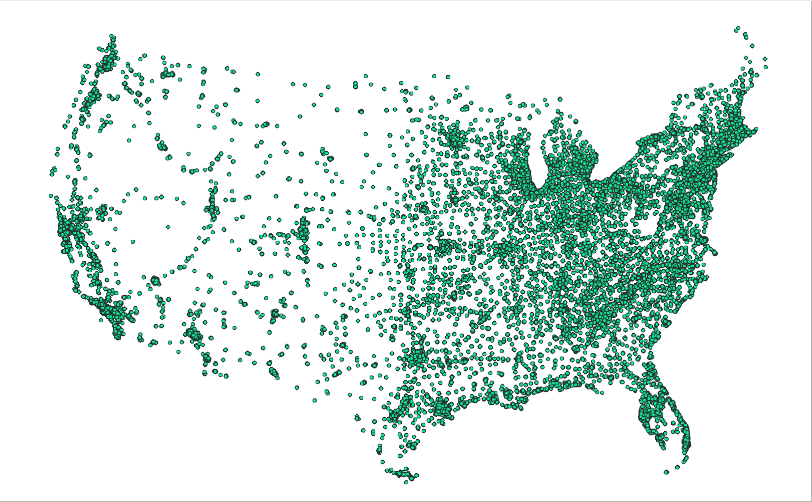
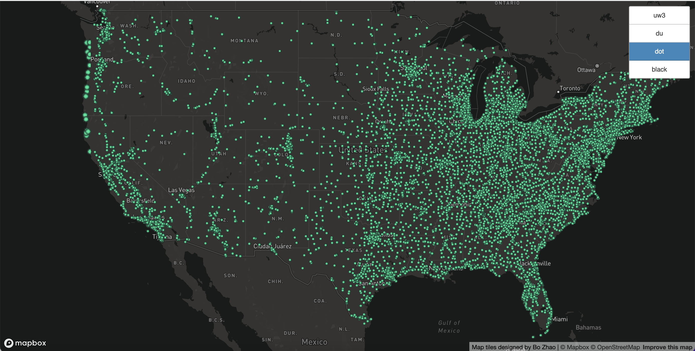
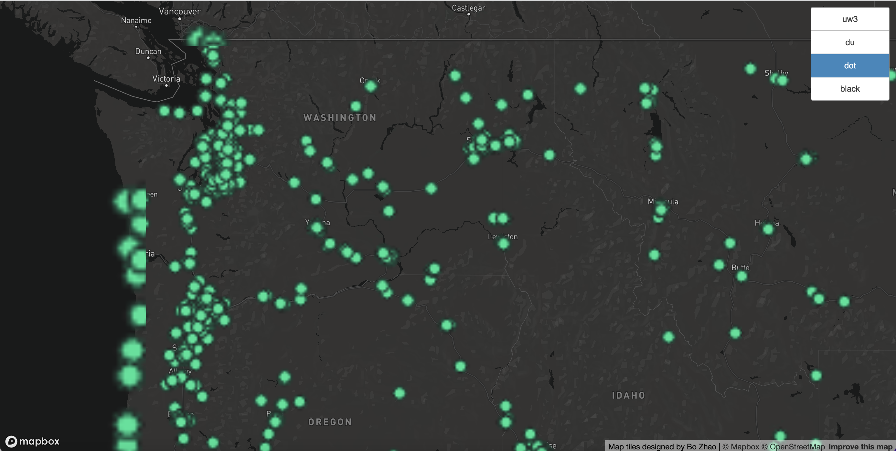
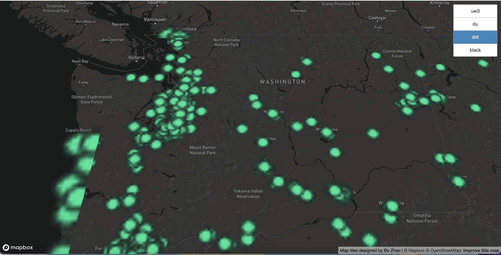

The dot density tile set visualizes the geographic distribution of fast food chain locations across the United States. Each green dot represents a franchise location, and the density pattern that emerges tells a clear story: the East Coast and major metro corridors are heavily saturated, while the interior West and rural stretches of the Midwest are comparatively sparse. The dark background keeps the glowing green dots visually prominent across all zoom levels.

### 3. Combined Basemap + Dot Density (du)
**Geographic Area:** Contiguous United States  
**Zoom Levels:** 0–5

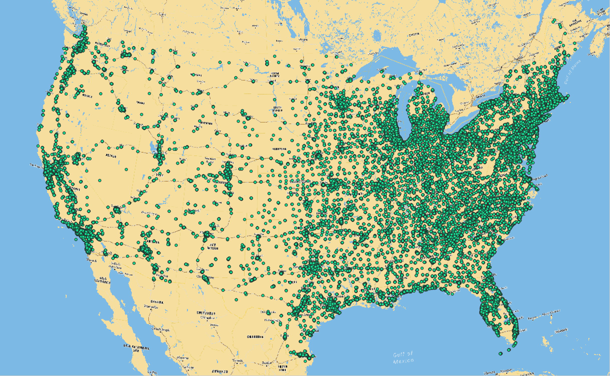
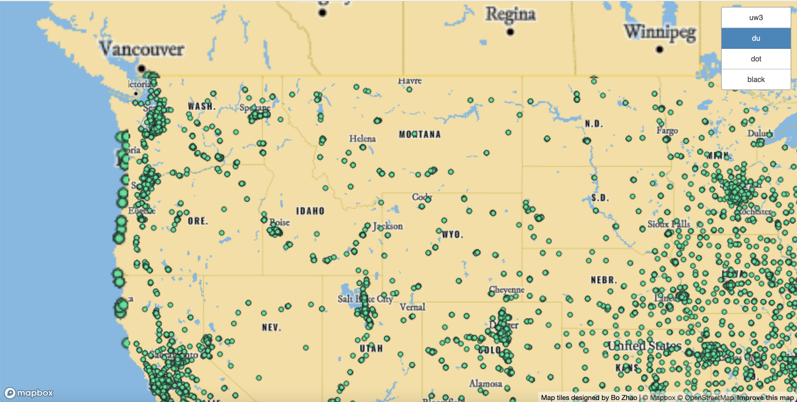
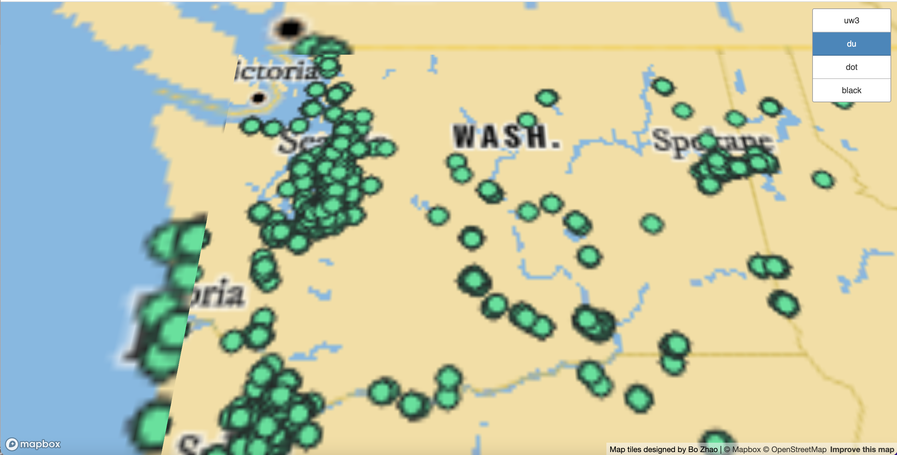

The combined tile set merges the custom basemap with the fast food dot density layer, showing franchise locations in geographic context. With both layers rendered together, it becomes easier to read the relationship between population corridors, infrastructure, and fast food density — the dots track closely along interstate highways and coastal metro areas. The warm tan of the basemap provides enough contrast to keep the green dots legible without the high-contrast dark background of the standalone dot layer.

### 4. Black Lives Matter Tilemap (black)
**Geographic Area:** Contiguous United States, centered on the Southeast  
**Zoom Levels:** 0–8

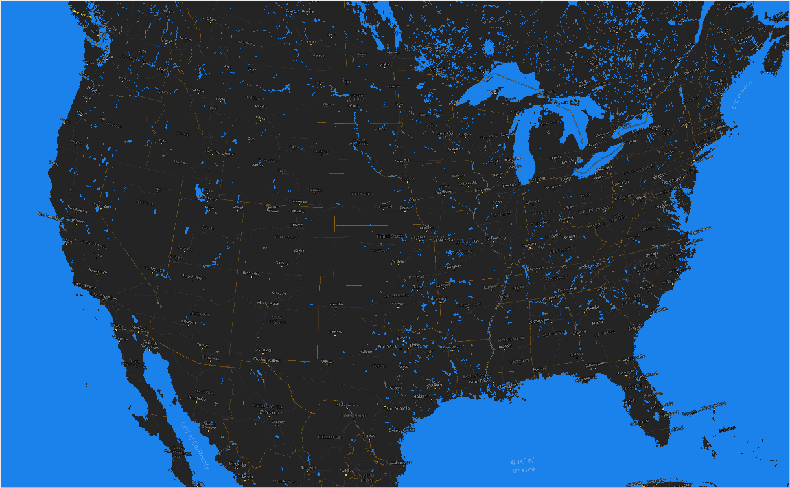
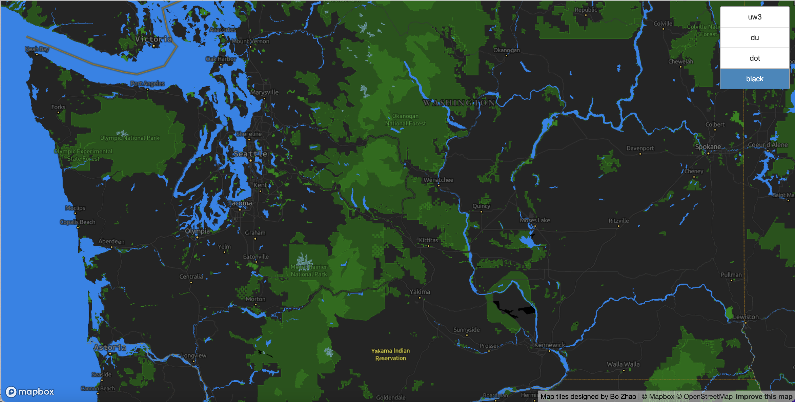
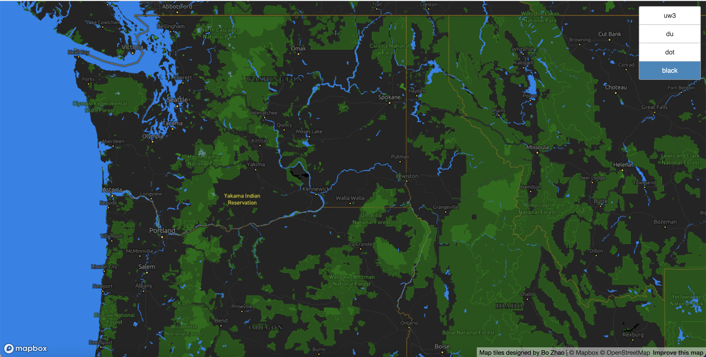

The Black Lives Matter tile set was designed in **Mapbox Studio** as a thematically driven map layer. The color palette, typography, and icon choices were all selected to reflect the visual language of the BLM movement — dark backgrounds, bold label treatments, and a color scheme consistent with the movement's established aesthetic. This tile set has the highest maximum zoom of the four (0–8), allowing it to be explored at a finer level of detail than the others. The geographic focus is centered on the southeastern United States, a region central to the history and ongoing conversation around racial justice in America.

## Optimizations

One of the recurring considerations across all four tile sets was balancing zoom range against tile count and repository size. GitHub has storage constraints, so keeping the bounding boxes tight and zoom ceilings reasonable (maxZoom 5 for most tile sets, 8 for the BLM layer) was a necessary tradeoff. Going higher on zoom would have produced sharper tiles at street level but at the cost of a much larger tile directory.

The layer switcher in the main `index.html` was built using Mapbox GL JS's native visibility toggling rather than adding and removing layers from the map — this keeps the tile sources loaded in memory and makes switching between layers feel immediate rather than triggering a reload. Each layer starts with `visibility: 'none'` and gets toggled on click, with the active state reflected in the button styling.

The BLM tile set was given a higher zoom ceiling than the others specifically because thematic map layers with social context benefit from being readable at a finer scale — you want to be able to zoom into a region and still have the design legible and intentional-looking.

## Lessons Learned

This project made it clear how much of web map design happens before a single line of JavaScript gets written. The decisions made in Mapbox Studio — color palette, font choice, icon selection, layer order — determine whether a map reads as intentional or generic, and those choices compound across zoom levels in ways that aren't always obvious until you're looking at the rendered tiles.

Working with **QTiles** for tile generation also highlighted the importance of thinking ahead about zoom range and bounding box scope. Every additional zoom level multiplies the tile count, so understanding the relationship between zoom, resolution, and file size early in the process saves a lot of backtracking.

Getting the layer switcher wired up correctly in **Mapbox GL JS** — handling the `idle` event to ensure layers exist before building the toggle buttons, using `getLayoutProperty` to check current visibility state, and managing the active CSS class — was probably the most technically involved part of the front-end work, and it reinforced how event-driven browser environments require careful attention to timing and state.
